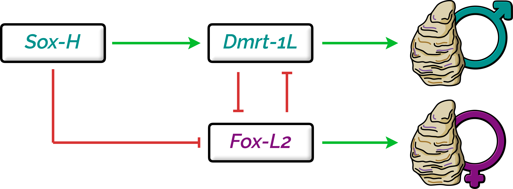

# Analysis in bivalves

In this folder you'll find all the code, input files, and intermediate results for the bivalve dataset (which includes both annotated genomes and transcriptomes). In particular:

* <code>[00_input/](00_input)</code> contains some of the input files used throughout the analysis:

    * <code>[00_input/aa_subst_models.tsv](00_input/aa_subst_models.tsv)</code> is the conversion of amino acid substitution model names between ModelFinder and <code>dist.ml</code>;
    * <code>[00_input/bivalve_genomes_toDownload.tsv](00_input/bivalve_genomes_toDownload.tsv)</code> contains the list of the NCBI accession numbers for the analysed bivalve genomes;
    * <code>[00_input/complete_dataset_withTaxonomy.tsv](00_input/complete_dataset_withTaxonomy.tsv)</code> is a table containing all the analysed bivalve species, plus some metadata (e.g., taxonomy);
    * <code>[00_input/dmrt_reference.faa](00_input/dmrt_reference.faa)</code> contains the sequences of the reference genes used to annotate the bivalve Dmrt complement;
    * <code>[00_input/dmrt_reference.tsv](00_input/dmrt_reference.tsv)</code> contains the names of the reference genes used to annotate the bivalve Dmrt complement;
    * <code>[00_input/fox_reference_outgroup.faa](00_input/fox_reference_outgroup.faa)</code> contains the sequences of the reference genes used to annotate the bivalve Fox complement, plus of genes used to root the tree;
    * <code>[00_input/fox_reference_outgroup.tsv](00_input/fox_reference_outgroup.tsv)</code> contains the names of the reference genes used to annotate the bivalve Fox complement, plus of genes used to root the tree;
    * <code>[00_input/PF00250.fox.alignment.full.stk](00_input/PF00250.fox.alignment.full.stk)</code> is the original Pfam Stockholm alignment used to retrieve Fox genes from bivalve genomes and transcriptomes;
    * <code>[00_input/PF00505.sox.alignment.full.stk](00_input/PF00505.sox.alignment.full.stk)</code> is the original Pfam Stockholm alignment used to retrieve Sox genes from bivalve genomes and transcriptomes;
    * <code>[00_input/PF00751.dmrt.alignment.full.stk](00_input/PF00751.dmrt.alignment.full.stk)</code> is the original Pfam Stockholm alignment used to retrieve Dmrt genes from bivalve genomes and transcriptomes;
    * <code>[00_input/sox_reference_outgroup.faa](00_input/sox_reference_outgroup.faa)</code> contains the sequences of the reference genes used for annotating the bivalve Sox complement, plus of genes used to root the tree;
    * <code>[00_input/sox_reference_outgroup.tsv](00_input/sox_reference_outgroup.tsv)</code> contains the names of the reference genes used for annotating the bivalve Sox complement, plus of genes used to root the tree;
    * <code>[00_input/species_tree.nwk](00_input/species_tree.nwk)</code> is the bivalve species tree used in the analyses, as inferred from literature;
    * <code>[00_input/species_tree_ALL.nwk](00_input/species_tree_ALL.nwk)</code> is the species tree of bivalves, other molluscs, and reference species, as used in plots;
    * <code>[00_input/Spur_fox.faa](00_input/Spur_fox.faa)</code> contains the sequences of the Fox complement from *Strongylocentrotus purpuratus*.

* <code>[compiled_softwares/](compiled_softwares/)</code> contains some of the compiled softwares as used in the analyses;
* <code>[conda_envs/](conda_envs/)</code> contains the YAML files of the conda environment used in the analyses;
* <code>[intermediate_results/](intermediate_results/)</code> contains some of the intermediate results obtained throughout the analyses;

    * <code>[intermediate_results/01_FINAL_dataset/](intermediate_results/01_FINAL_dataset/)</code> contains the amino acid and nucleotide sequences of annotated genes from the bivalve dataset, after their processing;
    * <code>[intermediate_results/02_SRG_sequences_phylotree/](intermediate_results/02_SRG_sequences_phylotree/)</code> contains the sequences and the ML phylogenetic trees of annotated Dmrt, Sox, and Fox genes in bivalves;
    * <code>[intermediate_results/03_possvm_orthology/](intermediate_results/03_possvm_orthology/)</code> contains the result of the possvm orthology inference in Dmrt, Sox, and Fox genes;
    * <code>[intermediate_results/04_OrthoFinder_orthogroups/](intermediate_results/04_OrthoFinder_orthogroups/)</code> contains some of the major result files of OrthoFinder;
    * <code>[intermediate_results/05_decomposed_orthogroups/](intermediate_results/05_decomposed_orthogroups/)</code> contains the results of the orthogroup decomposition (with the list of the obtained decomposed orthogroups and their genes), as well as the annotation of Dmrt, Sox, and Fox decomposed orthogroups;
    * <code>[intermediate_results/06_SRGs_occurence/](intermediate_results/06_SRGs_occurence/)</code> contains the presence/absence matrix of Dmrt, Sox, and Fox genes in the analysed species, as well as the annotation of possvm orthogroups;
    * <code>[intermediate_results/07_distribution_divergence/](intermediate_results/07_distribution_divergence/)</code> contains the median values of the amino acid sequence divergence per decomposed orthogroup, as well as the amino acid substitution models and other metadata;
    * <code>[intermediate_results/08_additional_trees/](intermediate_results/08_additional_trees/)</code> contains additional ML phylogenetic trees of Dmrt, Sox, and Fox genes, inferred to better establish the identity of certain groups;
    * <code>[intermediate_results/09_GO_enrichment/](intermediate_results/09_GO_enrichment/)</code> contains the GO-enrichment results, divided per category (Biological Process, Cellular Component, or Molecular Function) and per enrichment method (classic or elim, as implemented in <code>topGO</code>);

* <code>[scripts/](scripts/)</code> contains all the scripts used in the analyses, each with extensive code comments;
* <code>[pipeline.sh](pipeline.sh)</code> is the entire pipeline documenting the analyses, containing extensive code comments; mind that every command is supposed to be run from the current directory.