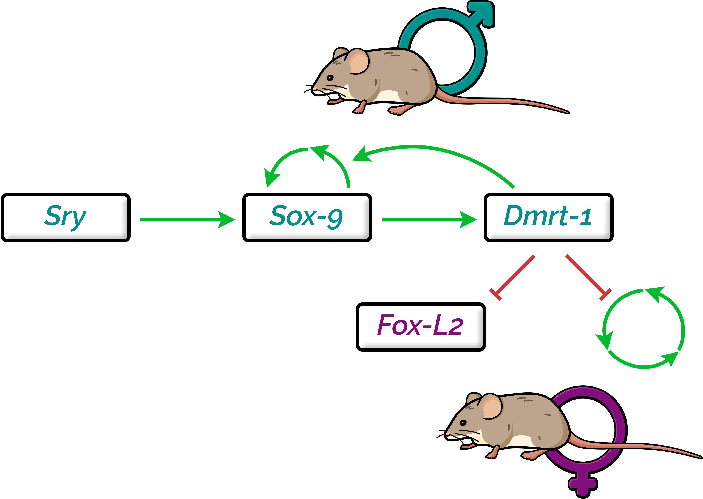

# Analysis in bivalves

In this folder you'll find all the code, input files, and intermediate results for the mammal dataset (which includes reference genomes). In particular:

* [`00_input/`](00_input) contains some of the input files used throughout the analysis:

    * [`00_input/aa_subst_models.tsv`](00_input/aa_subst_models.tsv) is the conversion of amino acid substitution model names between ModelFinder and `dist.ml`;
    * [`00_input/fox_outgroup.faa`](00_input/fox_reference_outgroup.faa) contains the sequences of the genes used to root the Fox gene tree;
    * [`00_input/mammalia_genomes_toDownload.tsv`](00_input/mammalia_genomes_toDownload.tsv) contains the list of the NCBI accession numbers for the analysed mammal genomes;
    * [`00_input/PF00250.fox.alignment.full.stk`](00_input/PF00250.fox.alignment.full.stk) is the original Pfam Stockholm alignment used to retrieve Fox genes from mammal genomes;
    * [`00_input/PF00505.sox.alignment.full.stk`](00_input/PF00505.sox.alignment.full.stk) is the original Pfam Stockholm alignment used to retrieve Sox genes from mammal genomes;
    * [`00_input/PF00751.dmrt.alignment.full.stk`](00_input/PF00751.dmrt.alignment.full.stk) is the original Pfam Stockholm alignment used to retrieve Dmrt genes from mammal genomes;
    * [`00_input/fox_outgroup.faa`](00_input/fox_reference_outgroup.faa) contains the sequences of the genes used to root the Sox gene tree;
    * [`00_input/species_tree.nwk`](00_input/species_tree.nwk) is the mammal species tree used in the analyses, as inferred from literature;
    * [`00_input/species_tree_ALL.nwk`](00_input/species_tree_ALL.nwk) is the species tree of mammals and the outgroup, as used in plots;

* [`compiled_softwares/`](compiled_softwares/) contains some of the compiled softwares as used in the analyses;
* [`conda_envs/`](conda_envs/) contains the YAML files of the conda environment used in the analyses;
* [`intermediate_results/`](intermediate_results/) contains some of the intermediate results obtained throughout the analyses;

    * [`intermediate_results/01_FINAL_dataset/`](intermediate_results/01_FINAL_dataset/) contains the amino acid and nucleotide sequences of annotated genes from the mammal dataset, after their processing;
    * [`intermediate_results/02_SRG_sequences_phylotree/`](intermediate_results/02_SRG_sequences_phylotree/) contains the sequences and the ML phylogenetic trees of annotated Dmrt, Sox, and Fox genes in mammals;
    * [`intermediate_results/03_possvm_orthology/`](intermediate_results/03_possvm_orthology/) contains the result of the possvm orthology inference in Dmrt, Sox, and Fox genes;
    * [`intermediate_results/04_OrthoFinder_orthogroups/`](intermediate_results/04_OrthoFinder_orthogroups/) contains some of the major result files of OrthoFinder;
    * [`intermediate_results/05_decomposed_orthogroups/`](intermediate_results/05_decomposed_orthogroups/) contains the results of the orthogroup decomposition (with the list of the obtained decomposed orthogroups and their genes), as well as the annotation of Dmrt, Sox, and Fox decomposed orthogroups;
    * [`intermediate_results/06_SRGs_occurence/`](intermediate_results/06_SRGs_occurence/) contains the presence/absence matrix of Dmrt, Sox, and Fox genes in the analysed species, as well as the annotation of possvm orthogroups;
    * [`intermediate_results/07_distribution_divergence/`](intermediate_results/07_distribution_divergence/) contains the median values of the amino acid sequence divergence per decomposed orthogroup, as well as the amino acid substitution models and other metadata;
    * [`intermediate_results/08_GO_enrichment/`](intermediate_results/08_GO_enrichment/) contains the GO-enrichment results, divided per category (Biological Process, Cellular Component, or Molecular Function) and per enrichment method (classic or elim, as implemented in `topGO`);

* [`scripts/`](scripts/) contains all the scripts used in the analyses, each with extensive code comments;
* [`pipeline.sh`](pipeline.sh) is the entire pipeline documenting the analyses, containing extensive code comments; mind that every command is supposed to be run from the current directory.