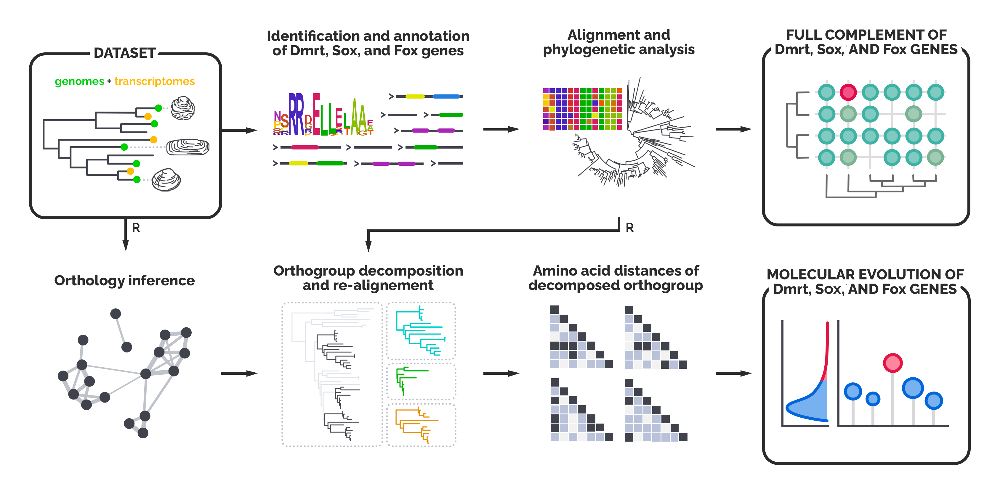

# Investigating the role of Dmrt, Sox, and Fox genes in the bivalve sex determination pathway through a genome-wide molecular evolution analysis — Data and code

In this repository you will find data and codes used to perform the analyses for the research paper:

> **[Nicolini F](https://github.com/filonico), Nuzhdin S, [Ghiselli F](https://github.com/fghiselli), [Luchetti A](https://github.com/andluche), Milani L**. *Investigating the role of Dmrt, Sox, and Fox genes in the bivalve sex determination pathway through a genome-wide molecular evolution analysis.*
>
> **Astract.** The molecular basis of sex determination (SD), while being extensively studied in model organisms, remains poorly understood in many animal groups. Bivalves, a diverse class of molluscs with a variety of reproductive modes, represent an ideal yet challenging clade for investigating SD and the evolution of sexual systems. However, the absence of a comprehensive framework has limited progress in this field, particularly regarding the study of sex-determination related genes (SRGs). In this study, we performed a genome-wide sequence evolutionary analysis of the Dmrt, Sox, and Fox gene families in more than 40 bivalve species. For the first time, we provide an extensive and phylogenetic-aware dataset of these SRGs, and we find support to the hypothesis that *Dmrt-1L* and *Sox-H* may act as primary sex-determining genes, by showing their high levels of sequence diversity within the bivalve genomic context. To validate our findings, we studied the same gene families in two well-characterized systems, mammals and *Drosophila*. In the former, we found that the male sex-determining gene *Sry* exhibits a pattern of amino acid sequence diversity similar to that of *Dmrt-1L* and *Sox-H* in bivalves, consistent with its role of master SD regulator. In contrast, no such pattern was observed among genes of the fruit fly SD cascade, which is controlled by a chromosomic mechanism. Overall, our findings highlight similarities in the sequence evolution of some mammal and bivalve SRGs, possibly driven by a comparable architecture of SD cascades. This work underscores once again the importance of employing a comparative approach when investigating understudied and non-model systems.

Visit our research group website, **[EVO·COM](https://sites.google.com/view/evo-com-unibo)**!

## What you can find here
This repository contains three different directories, one per each analysed dataset:
* in [`01_bivalves/`](01_bivalves) you can find data and codes used to analyse the dataset of bivalve genomes and transcriptomes;
* in [`02_mammals/`](02_mammals) you can find data and codes used to analyse the dataset of mammal reference genomes;
* in [`03_drosophila/`](03_drosophila) you can find data and codes used to analyse the dataset of *Drosophila* sp. reference genomes.

Note that if you are going to repeat the analyses, you'll need to run commands and scripts as reported in the documented codes from within each directory.
 

